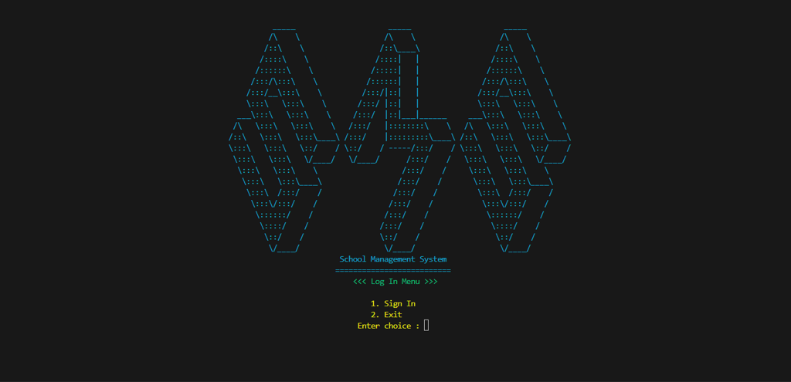
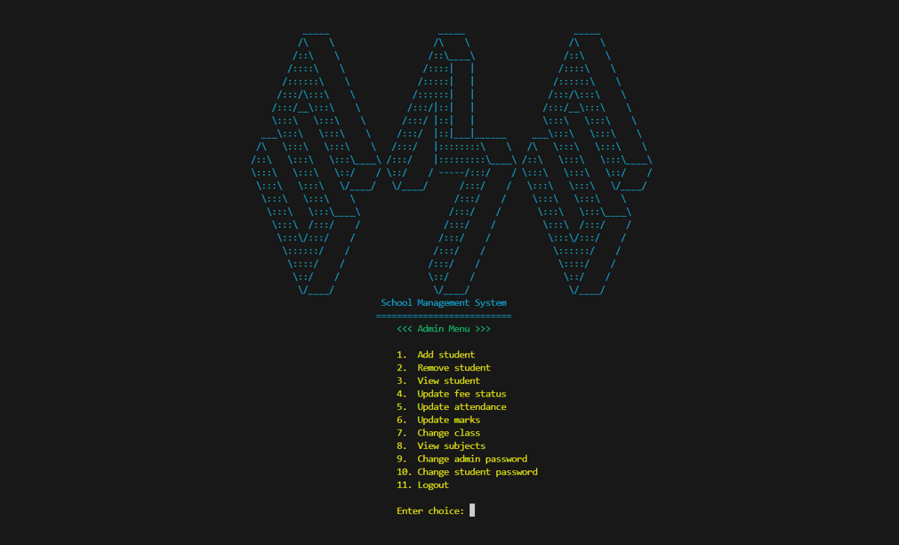

# Contra Shooter

**Contra Shooter** is a command-line interface (CLI) based shooter game developed in C++. Players engage in combat against three enemies, each with its own health system. The objective is to eliminate all enemies while managing limited lives, providing an engaging and strategic gameplay experience.

## Table of Contents
- [Features](#features)
- [Screenshots](#screenshots)
- [Usage](#usage)
- [Documentation](#documentation)
- [Technologies Used](#technologies-used)
- [Contributing](#contributing)
- [License](#license)

## Features
- **Enemy System**: Combat against three distinct enemies with health systems.
- **Health Management**: Players and enemies have health systems that affect gameplay.
- **Lives System**: Players have two lives to complete the game.
- **Scoreboard**: Track player performance throughout the game.

## Screenshots

## Usage
1. Clone the repository:
   `git clone https://github.com/miansaadtahir/contrashooter.git`
2. Navigate to the project directory:
   `cd ContraShooter`
3. Launch the `contrashooter.exe` file.

## Documentation
For a detailed overview of the gameplay mechanics and features, refer to the [Documentation](./documentation) in the repository.

## Technologies Used
- C++

## Contributing
Contributions, issues, and feature requests are welcome!  
Feel free to check out the [issues page](https://github.com/miansaadtahir/contrashooter/issues) for more information.

## License
Distributed under the MIT License. See [LICENSE](./LICENSE) for more details.
