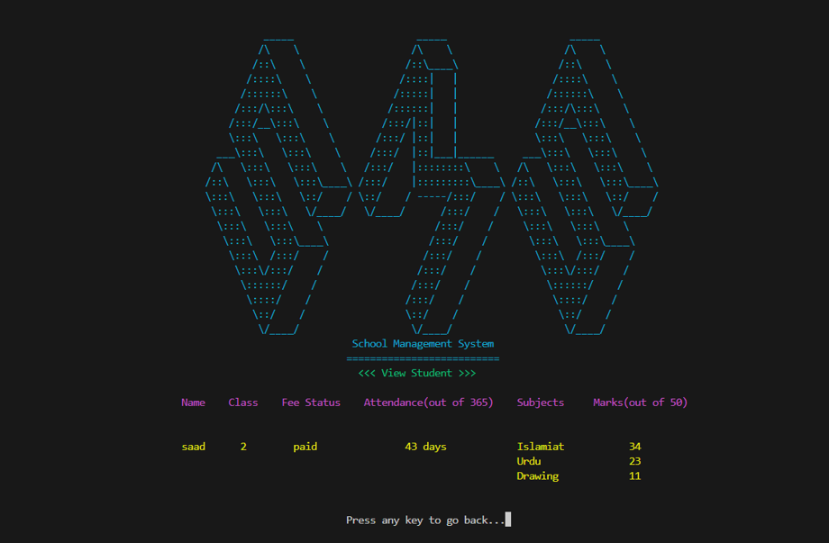
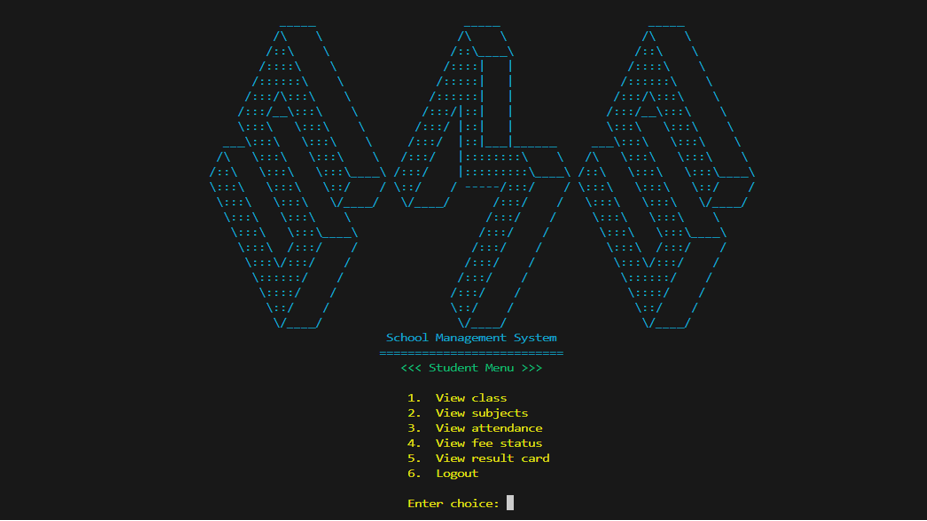

# Student Management System

**Student Management System** is a command-line interface (CLI) based application developed in C++. It allows two types of users—Admin and Student—to interact with the system. Admins can efficiently manage student records by adding, removing, and viewing student information, as well as updating their class marks, attendance, and fee status. Students can view their class subjects, marks, attendance, and fee status. This system provides a streamlined approach to student management, enhancing organizational efficiency and user experience.

## Table of Contents
- [Features](#features)
- [Screenshots](#screenshots)
- [Usage](#usage)
- [Documentation](#documentation)
- [Technologies Used](#technologies-used)
- [Contributing](#contributing)
- [License](#license)

## Features
- **Admin Capabilities**: 
  - Add, remove, and view student records.
  - Update student class marks, attendance, and fee status.
  - Change admin password for secure access.
  
- **Student Access**: 
  - View class subjects, marks, attendance, and fee status.
  
- **User Management**: Distinct roles for Admin and Student to ensure proper access control.
- **Data Management**: Efficient handling of student data for improved organizational efficiency.

## Screenshots

## Usage
1. Clone the repository:
   `git clone https://github.com/miansaadtahir/StudentManagementSystem.git`
2. Navigate to the project directory:
   `cd StudentManagementSystem`
3. Launch the `StudentManagementSystem.exe` file.

## Documentation
For a detailed overview of the project, refer to the [Documentation](./documentation) in the repository.

## Technologies Used
- C++

## Contributing
Contributions, issues, and feature requests are welcome!  
Feel free to check out the [issues page](https://github.com/miansaadtahir/StudentManagementSystem/issues) for more information.

## License
Distributed under the MIT License. See [LICENSE](./LICENSE) for more details.
